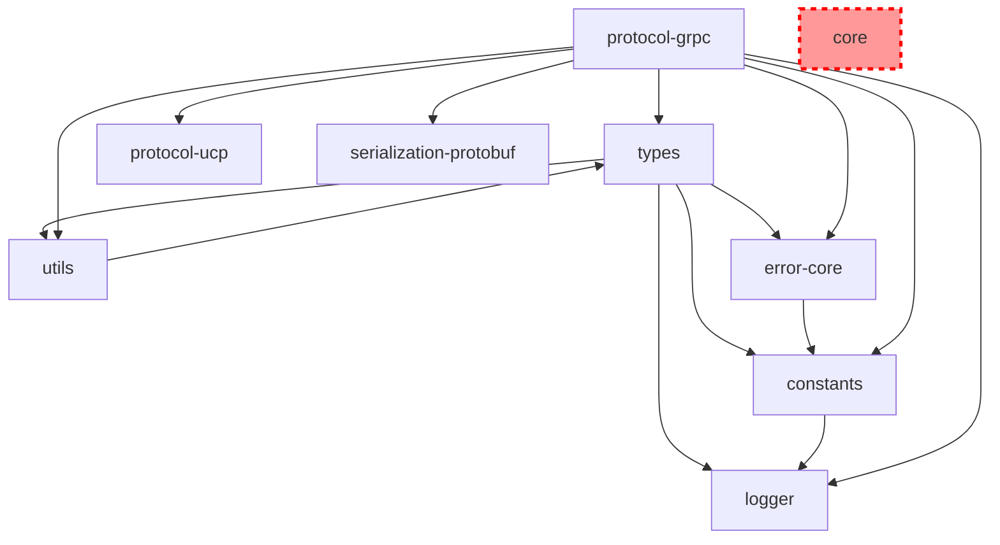

# Sker-CLI 架构分析报告

## 概述

本报告深入分析了当前 sker-cli 项目的 monorepo 架构，重点关注各包之间的依赖关系、集成状况以及存在的架构问题。通过对13个核心包的全面分析，发现了一个关键的架构问题：**@sker/core 作为基础设施包完全未被使用，导致各协议包重复实现基础功能**。

## 🚨 核心发现

### 1. 零集成问题 - @sker/core 未被实际使用

**最重要的发现**：尽管 `@sker/core` 提供了完整的基础设施能力，但在整个 monorepo 中**没有任何包实际导入或使用 @sker/core 的功能**。

#### @sker/core 提供的核心能力（未被使用）：
- **SkerCore**: 中央服务协调器，具备生命周期管理
- **EventBus**: 事件驱动通信系统
- **ConfigManager**: 配置管理与变更检测
- **LifecycleManager**: 服务启动/停止生命周期与钩子函数
- **PluginManager**: 插件系统，支持功能扩展
- **MiddlewareManager**: 请求/响应中间件链
- **Context**: 请求上下文管理，支持链路追踪

### 2. 架构模式重复实现

各包独立实现了核心功能模式，造成代码重复：

#### 事件管理重复实现：
```typescript
// 当前状况：多个包直接继承 Node.js EventEmitter
@sker/logger extends EventEmitter
@sker/protocol-websocket extends EventEmitter  
@sker/protocol-grpc extends EventEmitter
@sker/protocol-ucp extends EventEmitter

// 应该：使用 @sker/core 的 EventBus
```

#### 生命周期管理重复实现：
```typescript
// protocol-grpc/src/core/grpc-server.ts
class GRPCServer {
  async start() { /* 自定义实现 */ }
  async stop() { /* 自定义实现 */ }
  gracefulShutdown() { /* 自定义实现 */ }
}

// protocol-ucp/src/core/ucp-manager.ts  
class UCPManager {
  async start() { /* 不同的自定义实现 */ }
  async stop() { /* 不同的自定义实现 */ }
}

// 应该：统一使用 @sker/core 的 LifecycleManager
```

#### 中间件系统重复实现：
- `@sker/protocol-websocket`: 自定义中间件链
- `@sker/protocol-grpc`: 自定义中间件执行
- `@sker/protocol-http`: 独立的中间件系统
- **缺少**: 共享中间件基础设施

## 📊 当前依赖关系分析

### 实际依赖图：


### 依赖统计：
- **@sker/types**: 被11个包依赖 ✅
- **@sker/constants**: 被9个包依赖 ✅
- **@sker/logger**: 被7个包依赖 ✅
- **@sker/error-core**: 被7个包依赖 ✅
- **@sker/utils**: 被6个包依赖 ✅
- **@sker/core**: 被0个包依赖 ❌

## 🎯 优先集成候选包

### 高优先级 (应立即集成)：

#### 1. @sker/protocol-grpc
```typescript
// 当前实现
class GRPCServer extends EventEmitter {
  private middleware: Middleware[] = [];
  private lifecycle: 'stopped' | 'starting' | 'started' | 'stopping' = 'stopped';
  
  async start() {
    this.lifecycle = 'starting';
    // 自定义启动逻辑
    this.lifecycle = 'started';
    this.emit('started');
  }
}

// 应该的实现
class GRPCServer extends SkerCore {
  constructor(options: GRPCServerOptions) {
    super({
      serviceName: 'grpc-server',
      version: options.version,
      environment: options.environment
    });
    // 继承生命周期、事件、配置、中间件管理
  }
}
```

#### 2. @sker/protocol-ucp
- 作为统一通信协议管理器，应该是核心基础设施的主要使用者
- 包含复杂的协议工厂和适配器系统
- 需要统一的生命周期和配置管理

#### 3. @sker/protocol-websocket
- 具有复杂的连接管理和事件处理
- 实现了自定义中间件系统
- 需要标准化的服务器生命周期

### 中优先级：

#### 4. @sker/logger
```typescript
// 当前：独立的日志管理
// 应该：使用 core 的配置管理和插件系统扩展日志能力
```

#### 5. @sker/data-udef
```typescript
// 当前：静态数据转换
// 应该：通过插件架构支持自定义数据转换器
```

## ⚠️ 识别的架构问题

### 1. 基础设施碎片化
- **问题**: 每个协议包重新发明通用模式
- **影响**: 代码重复、维护困难、行为不一致
- **解决方案**: 统一使用 @sker/core 基础设施

### 2. 缺乏服务编排
- **问题**: 没有中央化的服务管理
- **影响**: 难以协调多个协议服务的启动顺序和依赖关系
- **解决方案**: 使用 SkerCore 作为服务编排器

### 3. 生命周期管理不一致
```typescript
// 当前：每个包不同的启动/停止模式
protocol-grpc: start() -> started event
protocol-ucp: start() -> ready event  
protocol-websocket: listen() -> connection events

// 应该：标准化的生命周期模式
core.start() -> lifecycle hooks -> all protocols started
```

### 4. 有限的可扩展性
- **问题**: 没有利用插件系统进行协议扩展
- **影响**: 添加新功能需要修改核心代码
- **解决方案**: 通过 PluginManager 实现协议扩展

### 5. 事件系统隔离
- **问题**: 协议事件不集成到核心事件系统
- **影响**: 无法统一监控和调试跨协议事件
- **解决方案**: 通过核心 EventBus 路由所有事件

## 🛠️ 集成重构路径

### 阶段1: 基础集成
1. **添加依赖**: 在协议包中添加 `@sker/core` 依赖
2. **基类重构**: 让协议服务器继承 SkerCore
3. **事件迁移**: 将自定义事件迁移到核心 EventBus

### 阶段2: 中间件统一
1. **中间件标准化**: 使用核心 MiddlewareManager
2. **配置集中化**: 迁移到 ConfigManager
3. **生命周期标准化**: 统一启动/停止模式

### 阶段3: 插件架构
1. **协议插件化**: 将协议特性实现为插件
2. **扩展点定义**: 为协议扩展定义标准接口
3. **监控集成**: 统一指标收集和监控

## 📋 具体实施建议

### 1. 立即行动项
```bash
# 1. 为高优先级包添加 core 依赖
cd packages/protocol-grpc
npm install @sker/core

# 2. 重构协议基类
# 将 extends EventEmitter 改为 extends SkerCore
```

### 2. 重构示例
```typescript
// packages/protocol-grpc/src/core/grpc-server.ts
import { SkerCore, CoreOptions } from '@sker/core';

interface GRPCServerOptions extends CoreOptions {
  port: number;
  host: string;
  maxConnections?: number;
}

export class GRPCServer extends SkerCore {
  constructor(options: GRPCServerOptions) {
    super({
      serviceName: 'grpc-server',
      version: '1.0.0',
      ...options
    });
    
    // 配置协议特定的生命周期钩子
    this.getLifecycle().onStart(this.startGRPCServer.bind(this));
    this.getLifecycle().onStop(this.stopGRPCServer.bind(this));
  }
  
  private async startGRPCServer(): Promise<void> {
    // gRPC 特定的启动逻辑
  }
  
  private async stopGRPCServer(): Promise<void> {
    // gRPC 特定的停止逻辑
  }
}
```

### 3. 配置标准化
```typescript
// 统一配置模式
const server = new GRPCServer({
  serviceName: 'user-service',
  version: '1.0.0',
  environment: 'production',
  config: {
    sources: [
      { type: 'env' },
      { type: 'file', path: './config.json' }
    ]
  },
  plugins: [
    { name: 'metrics', package: '@sker/plugin-metrics' },
    { name: 'auth', package: '@sker/plugin-auth' }
  ]
});
```

## 🎯 预期收益

### 1. 代码重复减少
- 消除重复的生命周期管理代码
- 统一事件处理模式
- 共享中间件基础设施

### 2. 维护性提升
- 集中化的配置管理
- 标准化的错误处理
- 统一的日志和监控

### 3. 扩展性增强
- 插件化架构支持动态功能扩展
- 标准化的协议扩展接口
- 更好的测试和调试能力

### 4. 一致性改进
- 统一的 API 设计模式
- 标准化的服务生命周期
- 一致的配置和部署模式

## 结论

当前 sker-cli 项目面临的最大问题是架构层面的：**核心基础设施包 @sker/core 完全未被使用，导致各个协议包独立实现基础功能，造成代码重复和维护困难**。

通过系统性的集成重构，可以显著提升项目的架构质量、代码重用性和维护效率。建议立即启动 @sker/core 集成工作，优先处理协议包的重构。

---

*本分析报告基于对13个核心包的深入代码审查和依赖关系分析生成。*