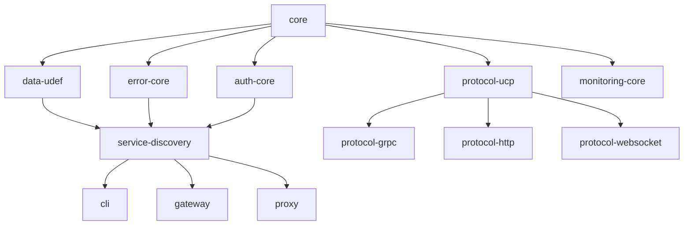

## 工具包规划 (@sker)

### 1. 核心基础包 (Level 1 - 无外部依赖)

packages/
├── @sker/core                    # 核心基础功能
├── @sker/types                   # 通用类型定义
├── @sker/utils                   # 通用工具函数
├── @sker/constants               # 全局常量定义
└── @sker/logger                  # 统一日志系统

### 2. 协议与通信包 (Level 2)

packages/
├── @sker/protocol-ucp            # 统一通信协议(UCP)实现
├── @sker/protocol-grpc           # gRPC协议支持
├── @sker/protocol-http           # HTTP/REST协议支持
├── @sker/protocol-websocket      # WebSocket协议支持
├── @sker/protocol-messagequeue   # 消息队列协议支持
├── @sker/serialization-protobuf  # Protocol Buffers序列化
├── @sker/serialization-json      # JSON序列化
└── @sker/serialization-msgpack   # MessagePack序列化

### 3. 数据交换与格式包 (Level 2)

packages/
├── @sker/data-udef              # 统一数据交换格式(UDEF)
├── @sker/data-validation        # 数据验证
├── @sker/data-transformation    # 数据转换
├── @sker/schema-registry        # Schema注册中心
└── @sker/type-mapping           # 跨语言类型映射

### 4. 服务治理包 (Level 3)

packages/
├── @sker/service-discovery      # 服务发现
├── @sker/service-registry       # 服务注册
├── @sker/load-balancer          # 负载均衡
├── @sker/circuit-breaker        # 熔断器
├── @sker/retry-policy           # 重试策略
└── @sker/health-check           # 健康检查

### 5. 安全认证包 (Level 3)

packages/
├── @sker/auth-core              # 认证核心
├── @sker/auth-jwt               # JWT认证
├── @sker/auth-oauth2            # OAuth2认证
├── @sker/auth-apikey            # API密钥认证
├── @sker/auth-mtls              # 双向TLS认证
├── @sker/rbac                   # 基于角色的访问控制
└── @sker/encryption             # 加密解密

###  6. 监控与可观测性包 (Level 3)

packages/
  ├── @sker/monitoring-core        # 监控核心
  ├── @sker/metrics-collector      # 指标收集
  ├── @sker/tracing-distributed    # 分布式追踪
  ├── @sker/logging-structured     # 结构化日志
  ├── @sker/alerting               # 告警系统
  └── @sker/dashboard              # 监控仪表板

###  7. 错误处理包 (Level 2)

packages/
  ├── @sker/error-core             # 错误处理核心
  ├── @sker/error-codes            # 标准错误码
  ├── @sker/exception-handling     # 异常处理
  └── @sker/error-reporting        # 错误报告

### 8. 应用层包 (Level 4)

apps/
  ├── @sker/cli                    # 命令行工具
  ├── @sker/gateway                # API网关
  ├── @sker/proxy                  # 通信代理
  └── @sker/admin                  # 管理界面

## 依赖关系图

### 开发优先级

Phase 1 (基础核心)
- @sker/core, @sker/types, @sker/utils
- @sker/logger, @sker/error-core

Phase 2 (通信协议)
- @sker/protocol-ucp, @sker/data-udef
- @sker/serialization-json, @sker/serialization-protobuf

Phase 3 (服务治理)
- @sker/service-discovery, @sker/service-registry
- @sker/auth-core, @sker/monitoring-core

Phase 4 (应用层)
- @sker/cli, @sker/gateway, @sker/admin

### 

初始化相关工具包
- 写一个README.md说明包的用途及功能 
- package.json 
- tsconfig.json 
- tsup.config.ts