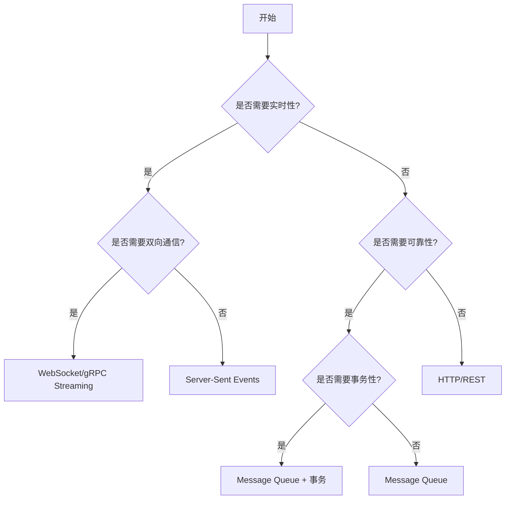
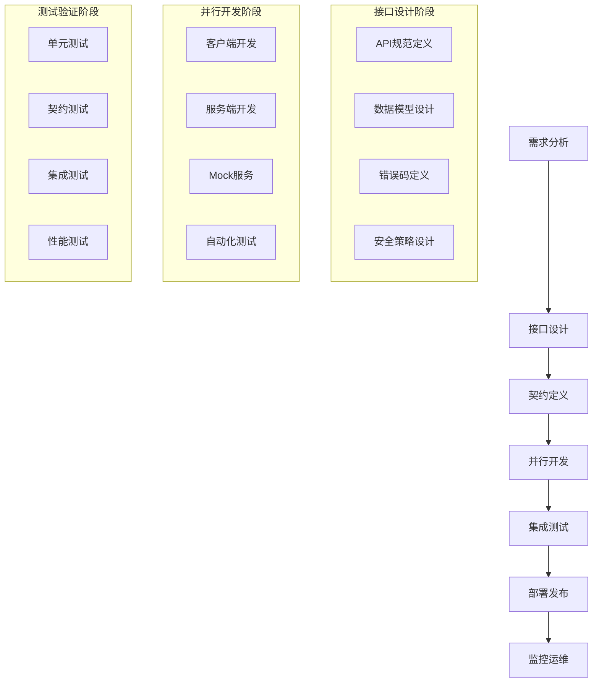

# 跨语言/跨进程/跨端通信标准工作流程

> **版本**: v1.0  
> **制定日期**: 2024年1月  
> **适用范围**: 企业级系统架构、微服务通信、分布式系统集成  
> **标准级别**: 企业标准  

---

## 目录

1. [标准概述](#标准概述)
2. [统一通信协议标准 (UCP)](#统一通信协议标准-ucp)
3. [统一数据交换格式规范 (UDEF)](#统一数据交换格式规范-udef)
4. [统一接口设计和命名约定 (UIDNC)](#统一接口设计和命名约定-uidnc)
5. [统一错误处理和状态管理标准](#统一错误处理和状态管理标准)
6. [统一服务发现和注册机制](#统一服务发现和注册机制)
7. [统一安全和认证标准](#统一安全和认证标准)
8. [统一监控和日志规范](#统一监控和日志规范)
9. [标准化开发工作流程](#标准化开发工作流程)
10. [实施示例和最佳实践](#实施示例和最佳实践)
11. [附录](#附录)

---

## 标准概述

### 目标和愿景

制定一套完整的跨语言/跨进程/跨端通信标准工作流程，旨在：

- **降低工作及沟通成本**：通过标准化减少理解偏差和集成复杂度
- **提高开发效率**：支持并行开发和快速集成
- **增强系统可靠性**：统一的错误处理和重试机制
- **简化运维管理**：标准化的监控和日志体系
- **保障安全合规**：一致的安全标准和最佳实践

### 核心原则

1. **标准化优先**：所有通信都遵循统一标准
2. **契约驱动**：API契约先行，支持并行开发
3. **向后兼容**：新版本保持向后兼容性
4. **安全第一**：内建安全机制，默认加密
5. **可观测性**：内建监控、日志和追踪能力
6. **语言无关**：支持主流编程语言和平台

### 挑战与解决方案

| 挑战                       | 解决方案                   |
| -------------------------- | -------------------------- |
| 不同编程语言的数据类型差异 | 统一数据类型映射标准       |
| 网络传输的可靠性和性能要求 | 标准化重试和熔断机制       |
| 版本兼容性和协议演进       | 语义化版本管理策略         |
| 服务发现和负载均衡         | 统一服务注册和发现机制     |
| 安全认证和授权机制         | 多层次安全标准体系         |
| 接口定义不统一导致理解偏差 | 统一命名约定和接口设计标准 |
| 错误处理方式不一致         | 标准化错误码和响应格式     |
| 调试和排错困难             | 统一日志格式和分布式追踪   |

---

## 1. 统一通信协议标准 (UCP - Unified Communication Protocol)

### 协议栈架构

```yaml
ucp_protocol_stack:
  version: "1.0"
  
  layers:
    application_layer:
      description: "业务逻辑层"
      protocols: ["RPC", "Message Queue", "Event Streaming"]
      responsibilities:
        - "业务接口定义"
        - "服务契约管理"
        - "业务逻辑处理"
    
    presentation_layer:
      description: "数据表示层"
      formats: ["Protocol Buffers", "JSON", "MessagePack"]
      responsibilities:
        - "数据序列化/反序列化"
        - "数据压缩"
        - "编码转换"
    
    session_layer:
      description: "会话管理层"
      mechanisms: ["连接池", "会话复用", "负载均衡"]
      responsibilities:
        - "连接生命周期管理"
        - "会话状态维护" 
        - "服务发现"
    
    transport_layer:
      description: "传输层"
      protocols: ["HTTP/2", "gRPC", "WebSocket", "TCP", "UDP"]
      responsibilities:
        - "可靠数据传输"
        - "流量控制"
        - "错误重传"
```

### 协议选择矩阵

| 通信模式 | 推荐协议                                      | 使用场景                         | 性能特点 | 复杂度 |
| -------- | --------------------------------------------- | -------------------------------- | -------- | ------ |
| 同步RPC  | gRPC, HTTP/REST, JSON-RPC                     | 实时查询、数据验证、业务规则调用 | 高性能   | 中等   |
| 异步消息 | Apache Kafka, RabbitMQ, Apache Pulsar         | 事件通知、数据同步、任务分发     | 中等性能 | 较高   |
| 实时流式 | WebSocket, Server-Sent Events, gRPC Streaming | 实时监控、在线协作、数据推送     | 高性能   | 中等   |

### 协议选择决策流程



### 协议选择矩阵
```python

 # 协议选择决策框架
class ProtocolSelector:
  def __init__(self):
      self.selection_matrix = {
          'synchronous_rpc': {
              'protocols': ['gRPC', 'HTTP/REST', 'JSON-RPC'],
              'use_cases': ['实时查询', '数据验证', '业务规则调用'],
              'performance': 'high',
              'complexity': 'medium'
          },
          'asynchronous_messaging': {
              'protocols': ['Apache Kafka', 'RabbitMQ', 'Apache Pulsar'],
              'use_cases': ['事件通知', '数据同步', '任务分发'],
              'performance': 'medium',
              'complexity': 'high'
          },
          'real_time_streaming': {
              'protocols': ['WebSocket', 'Server-Sent Events', 'gRPC Streaming'],
              'use_cases': ['实时监控', '在线协作', '数据推送'],
              'performance': 'high',
              'complexity': 'medium'
          }
      }

  def recommend_protocol(self, requirements):
      """基于需求推荐协议"""
      criteria = {
          'latency': requirements.get('latency_requirement'),
          'throughput': requirements.get('throughput_requirement'),
          'consistency': requirements.get('consistency_requirement'),
          'availability': requirements.get('availability_requirement')
      }

      # 协议评分和推荐逻辑
      return self.calculate_best_match(criteria)
```

---

## 2. 统一数据交换格式规范 (UDEF - Unified Data Exchange Format)

### 2.1 标准消息结构

```json
{
  "udef_message_schema": {
    "version": "1.0",
    "message_structure": {
      "envelope": {
        "header": {
          "message_id": {
            "type": "string",
            "format": "uuid",
            "required": true,
            "description": "全局唯一消息标识符"
          },
          "correlation_id": {
            "type": "string", 
            "format": "uuid",
            "required": false,
            "description": "关联消息ID，用于请求响应匹配"
          },
          "timestamp": {
            "type": "string",
            "format": "ISO8601",
            "required": true,
            "description": "消息创建时间戳"
          },
          "source": {
            "service_name": {"type": "string", "required": true},
            "service_version": {"type": "string", "required": true},
            "instance_id": {"type": "string", "required": false}
          },
          "destination": {
            "service_name": {"type": "string", "required": false},
            "routing_key": {"type": "string", "required": false}
          },
          "content_type": {
            "type": "string",
            "enum": ["application/json", "application/protobuf", "application/msgpack"],
            "default": "application/json"
          },
          "message_type": {
            "type": "string",
            "enum": ["request", "response", "event", "command"],
            "required": true
          }
        },
        "metadata": {
          "trace_id": {"type": "string", "description": "分布式追踪标识"},
          "span_id": {"type": "string", "description": "调用链跨度标识"},
          "priority": {"type": "integer", "minimum": 0, "maximum": 9, "default": 5},
          "ttl": {"type": "integer", "description": "消息存活时间(秒)"},
          "retry_count": {"type": "integer", "minimum": 0, "default": 0},
          "custom_properties": {"type": "object", "additionalProperties": true}
        }
      },
      "payload": {
        "data": {
          "description": "实际业务数据",
          "type": "object"
        },
        "schema_version": {
          "type": "string",
          "description": "数据模式版本"
        }
      }
    }
  }
}
```

### 2.2 数据类型映射标准

```python
# 跨语言数据类型映射标准
class CrossLanguageTypeMapping:
  def __init__(self):
      self.type_mappings = {
        'primitives': {
            'boolean': {
                'protobuf': 'bool',
                'json': 'boolean',
                'java': 'boolean',
                'python': 'bool',
                'javascript': 'boolean',
                'go': 'bool',
                'rust': 'bool',
                'csharp': 'bool'
            },
            'integer': {
                'protobuf': 'int64',
                'json': 'number',
                'java': 'Long',
                'python': 'int',
                'javascript': 'number',
                'go': 'int64',
                'rust': 'i64',
                'csharp': 'long'
            },
            'float': {
                'protobuf': 'double',
                'json': 'number',
                'java': 'Double',
                'python': 'float',
                'javascript': 'number',
                'go': 'float64',
                'rust': 'f64',
                'csharp': 'double'
            },
            'string': {
                'protobuf': 'string',
                'json': 'string',
                'java': 'String',
                'python': 'str',
                'javascript': 'string',
                'go': 'string',
                'rust': 'String',
                'csharp': 'string'
            }
        },
        'collections': {
            'array': {
                'protobuf': 'repeated',
                'json': 'array',
                'java': 'List<T>',
                'python': 'List[T]',
                'javascript': 'Array<T>',
                'go': '[]T',
                'rust': 'Vec<T>',
                'csharp': 'List<T>'
            },
            'map': {
                'protobuf': 'map<K,V>',
                'json': 'object',
                'java': 'Map<K,V>',
                'python': 'Dict[K,V]',
                'javascript': 'Map<K,V>',
                'go': 'map[K]V',
                'rust': 'HashMap<K,V>',
                'csharp': 'Dictionary<K,V>'
            }
        },
        'special_types': {
            'timestamp': {
                'protobuf': 'google.protobuf.Timestamp',
                'json': 'string (ISO8601)',
                'java': 'Instant',
                'python': 'datetime',
                'javascript': 'Date',
                'go': 'time.Time',
                'rust': 'chrono::DateTime<Utc>',
                'csharp': 'DateTime'
            },
            'decimal': {
                'protobuf': 'string',
                'json': 'string',
                'java': 'BigDecimal',
                'python': 'Decimal',
                'javascript': 'string',
                'go': 'decimal.Decimal',
                'rust': 'rust_decimal::Decimal',
                'csharp': 'decimal'
            }
        }
      }
```

### 2.3 序列化标准

```
 # 序列化格式选择标准
serialization_standards:
  protocol_buffers:
    advantages:
      - "高性能二进制序列化"
      - "强类型检查"
      - "向前向后兼容"
      - "跨语言支持完善"
    use_cases:
      - "高频调用接口"
      - "大数据量传输"
      - "微服务间通信"

  json:
    advantages:
      - "人类可读"
      - "调试友好"
      - "Web标准"
      - "简单易用"
    use_cases:
      - "Web API"
      - "配置文件"
      - "调试和测试"

  messagepack:
    advantages:
      - "比JSON更紧凑"
      - "保持可读性"
      - "支持二进制数据"
    use_cases:
      - "移动端通信"
      - "带宽受限环境"
      - "实时系统"
```

### 跨语言数据类型映射标准

| 逻辑类型   | Protocol Buffers          | JSON             | Java       | Python    | JavaScript | Go              | Rust                    | C#                |
| ---------- | ------------------------- | ---------------- | ---------- | --------- | ---------- | --------------- | ----------------------- | ----------------- |
| 布尔值     | bool                      | boolean          | boolean    | bool      | boolean    | bool            | bool                    | bool              |
| 整数       | int64                     | number           | Long       | int       | number     | int64           | i64                     | long              |
| 浮点数     | double                    | number           | Double     | float     | number     | float64         | f64                     | double            |
| 字符串     | string                    | string           | String     | str       | string     | string          | String                  | string            |
| 数组       | repeated                  | array            | List\<T\>  | List[T]   | Array\<T\> | []T             | Vec\<T\>                | List\<T\>         |
| 映射       | map\<K,V\>                | object           | Map\<K,V\> | Dict[K,V] | Map\<K,V\> | map[K]V         | HashMap\<K,V\>          | Dictionary\<K,V\> |
| 时间戳     | google.protobuf.Timestamp | string (ISO8601) | Instant    | datetime  | Date       | time.Time       | chrono::DateTime\<Utc\> | DateTime          |
| 高精度数值 | string                    | string           | BigDecimal | Decimal   | string     | decimal.Decimal | rust_decimal::Decimal   | decimal           |

### 序列化格式选择标准

| 格式             | 优势                                         | 使用场景                                 | 性能  | 可读性 |
| ---------------- | -------------------------------------------- | ---------------------------------------- | ----- | ------ |
| Protocol Buffers | 高性能二进制序列化、强类型检查、向前向后兼容 | 高频调用接口、大数据量传输、微服务间通信 | ⭐⭐⭐⭐⭐ | ⭐⭐     |
| JSON             | 人类可读、调试友好、Web标准、简单易用        | Web API、配置文件、调试和测试            | ⭐⭐⭐   | ⭐⭐⭐⭐⭐  |
| MessagePack      | 比JSON更紧凑、保持可读性、支持二进制数据     | 移动端通信、带宽受限环境、实时系统       | ⭐⭐⭐⭐  | ⭐⭐⭐    |

---

## 统一接口设计和命名约定 (UIDNC)

### 服务接口命名标准

```yaml
interface_naming_standards:
  service_naming:
    pattern: "{domain}.{subdomain}.{service}.v{version}"
    examples:
      - "user.authentication.service.v1"
      - "order.payment.gateway.v2"
      - "inventory.stock.management.v1"
    
  method_naming:
    patterns:
      crud_operations:
        create: "Create{ResourceName}"
        read: "Get{ResourceName}"
        update: "Update{ResourceName}"
        delete: "Delete{ResourceName}"
        list: "List{ResourceName}s"
      
      business_operations:
        pattern: "{Verb}{Object}{Context?}"
        examples:
          - "ProcessPayment"
          - "ValidateOrder"
          - "NotifyUser"
          - "CalculateDiscount"
    
  resource_naming:
    conventions:
      - "使用名词，采用PascalCase"
      - "单数形式表示单个资源"
      - "复数形式表示资源集合"
      - "避免缩写，使用完整单词"
    examples:
      - "User" (单个用户)
      - "Users" (用户列表)
      - "OrderItem" (订单项)
      - "PaymentTransaction" (支付交易)
```

### gRPC服务定义模板

```protobuf
// 标准gRPC服务定义模板
syntax = "proto3";

package {domain}.{service}.v{version};

option go_package = "{domain}/{service}/v{version}";
option java_package = "com.{domain}.{service}.v{version}";
option csharp_namespace = "{Domain}.{Service}.V{version}";

import "google/protobuf/timestamp.proto";
import "google/protobuf/empty.proto";

// 服务定义
service {ServiceName}Service {
  // 标准CRUD操作
  rpc Create{Resource}(Create{Resource}Request) returns (Create{Resource}Response);
  rpc Get{Resource}(Get{Resource}Request) returns (Get{Resource}Response);
  rpc Update{Resource}(Update{Resource}Request) returns (Update{Resource}Response);
  rpc Delete{Resource}(Delete{Resource}Request) returns (google.protobuf.Empty);
  rpc List{Resource}s(List{Resource}sRequest) returns (List{Resource}sResponse);
  
  // 业务操作
  rpc {BusinessOperation}({BusinessOperation}Request) returns ({BusinessOperation}Response);
}

// 通用请求响应结构
message BaseRequest {
  RequestMetadata metadata = 1;
}

message BaseResponse {
  ResponseMetadata metadata = 1;
  ResultStatus status = 2;
}

message RequestMetadata {
  string request_id = 1;
  string correlation_id = 2;
  google.protobuf.Timestamp timestamp = 3;
  string client_version = 4;
  map<string, string> custom_headers = 5;
}

message ResponseMetadata {
  string request_id = 1;
  string correlation_id = 2;
  google.protobuf.Timestamp timestamp = 3;
  string server_version = 4;
  int64 processing_time_ms = 5;
}

message ResultStatus {
  int32 code = 1;
  string message = 2;
  repeated ErrorDetail details = 3;
}

message ErrorDetail {
  string error_code = 1;
  string error_message = 2;
  string field_name = 3;
  map<string, string> context = 4;
}
```

### RESTful API设计标准

```yaml
rest_api_standards:
  url_structure:
    pattern: "/{api_version}/{domain}/{resource}"
    examples:
      - "/v1/users/123"
      - "/v2/orders/456/items"
      - "/v1/payments/transactions"
  
  http_methods:
    GET: "获取资源，幂等操作"
    POST: "创建资源，非幂等操作"
    PUT: "更新整个资源，幂等操作"
    PATCH: "部分更新资源，幂等操作"
    DELETE: "删除资源，幂等操作"
  
  status_codes:
    success:
      200: "请求成功，返回数据"
      201: "资源创建成功"
      204: "请求成功，无返回内容"
    client_errors:
      400: "请求参数错误"
      401: "未认证"
      403: "权限不足"
      404: "资源不存在"
      409: "资源冲突"
      422: "数据验证失败"
    server_errors:
      500: "服务器内部错误"
      502: "网关错误"
      503: "服务不可用"
```

---

## 统一错误处理和状态管理标准

### 标准错误码体系

```yaml
# 错误码格式: {Category}{SubCategory}{SpecificError}
# Category: 1位数字 (1-系统级, 2-业务级, 3-集成级, 4-安全级)
# SubCategory: 2位数字 (具体子分类)
# SpecificError: 3位数字 (具体错误)

error_code_system:
  system_errors: # 1xx-xxx
    general: # 100-xxx
      100001: "系统内部错误"
      100002: "服务不可用"
      100003: "服务超时"
      100004: "资源不足"
      100005: "配置错误"
      
    network: # 101-xxx
      101001: "网络连接失败"
      101002: "网络超时"
      101003: "网络中断"
      101004: "DNS解析失败"
      
    data: # 102-xxx
      102001: "数据序列化失败"
      102002: "数据反序列化失败"
      102003: "数据格式错误"
      102004: "数据大小超限"

  business_errors: # 2xx-xxx
    general: # 200-xxx
      200001: "业务规则违反"
      200002: "业务流程错误"
      200003: "业务状态不符"
      200004: "业务数据不一致"
      
    user: # 201-xxx
      201001: "用户不存在"
      201002: "用户已存在"
      201003: "用户状态异常"
      201004: "用户权限不足"
      
    order: # 202-xxx
      202001: "订单不存在"
      202002: "订单状态异常"
      202003: "订单金额异常"
      202004: "库存不足"

  integration_errors: # 3xx-xxx
    external: # 300-xxx
      300001: "第三方服务不可用"
      300002: "第三方服务响应异常"
      300003: "API版本不兼容"
      300004: "数据映射失败"
      
    database: # 301-xxx
      301001: "数据库连接失败"
      301002: "查询超时"
      301003: "事务回滚"
      301004: "约束违反"

  security_errors: # 4xx-xxx
    authentication: # 400-xxx
      400001: "认证失败"
      400002: "授权失败"
      400003: "token过期"
      400004: "签名验证失败"
      400005: "IP限制"
      400006: "频率限制"
      
    data_security: # 401-xxx
      401001: "敏感数据访问被拒绝"
      401002: "数据加密失败"
      401003: "数据解密失败"
```

### 错误响应标准格式

```json
{
  "error_response_schema": {
    "success": false,
    "error": {
      "code": "201001",
      "message": "用户不存在",
      "details": [
        {
          "field": "user_id",
          "error_code": "INVALID_VALUE",
          "error_message": "用户ID无效",
          "context": {
            "provided_value": "invalid_user_123",
            "expected_format": "numeric_id"
          }
        }
      ],
      "trace_id": "a1b2c3d4-e5f6-7890-abcd-ef1234567890",
      "timestamp": "2024-01-15T10:30:00Z",
      "help_url": "https://docs.api.com/errors/201001"
    },
    "metadata": {
      "request_id": "req_12345",
      "api_version": "v1",
      "processing_time_ms": 150
    }
  }
}
```

### 重试和熔断机制标准

```yaml
resilience_standards:
  retry_policies:
    exponential_backoff:
      initial_delay: 1000  # 1秒
      max_delay: 30000     # 30秒
      multiplier: 2.0
      max_attempts: 3
      jitter: true
      
    fixed_interval:
      delay: 5000          # 5秒
      max_attempts: 5
      
    linear_backoff:
      initial_delay: 1000
      increment: 1000
      max_attempts: 3

  circuit_breaker_config:
    failure_threshold: 5        # 失败阈值
    recovery_timeout: 60000     # 恢复超时(毫秒)
    half_open_max_calls: 3      # 半开状态最大调用数
    slow_call_threshold: 5000   # 慢调用阈值(毫秒)
    slow_call_rate_threshold: 0.5  # 慢调用比率阈值

  timeout_config:
    connection_timeout: 5000    # 连接超时
    read_timeout: 30000         # 读取超时
    write_timeout: 10000        # 写入超时
```

---

## 统一服务发现和注册机制

### 服务注册信息标准

```yaml
service_registry_schema:
  service_metadata:
    basic_info:
      service_name: "string, required"
      service_version: "string, required, semantic version"
      service_id: "string, required, unique identifier"
      description: "string, optional"
      
    network_info:
      host: "string, required"
      port: "integer, required"
      protocol: "enum: [http, https, grpc, tcp, udp]"
      base_path: "string, optional, for HTTP services"
      
    health_check:
      endpoint: "string, required"
      interval: "integer, seconds, default: 30"
      timeout: "integer, seconds, default: 10"
      retries: "integer, default: 3"
      
    capabilities:
      supported_protocols: ["http", "grpc", "websocket"]
      api_versions: ["v1", "v2"]
      features: ["authentication", "rate_limiting", "caching"]
      
    resource_requirements:
      cpu: "string, e.g., 100m"
      memory: "string, e.g., 256Mi"
      storage: "string, optional"
      
    tags:
      environment: "enum: [dev, staging, prod]"
      region: "string"
      datacenter: "string"
      custom_tags: "map[string]string"
      
    sla:
      availability: "float, percentage, e.g., 99.9"
      response_time_p99: "integer, milliseconds"
      throughput: "integer, requests per second"
```

### 服务发现API标准

```protobuf
// 服务发现API定义
syntax = "proto3";

package service.discovery.v1;

// 服务发现服务
service ServiceDiscoveryService {
  // 注册服务
  rpc RegisterService(RegisterServiceRequest) returns (RegisterServiceResponse);
  
  // 注销服务
  rpc DeregisterService(DeregisterServiceRequest) returns (DeregisterServiceResponse);
  
  // 发现服务
  rpc DiscoverServices(DiscoverServicesRequest) returns (DiscoverServicesResponse);
  
  // 获取服务详情
  rpc GetService(GetServiceRequest) returns (GetServiceResponse);
  
  // 健康检查
  rpc HealthCheck(HealthCheckRequest) returns (HealthCheckResponse);
  
  // 监听服务变化
  rpc WatchServices(WatchServicesRequest) returns (stream ServiceChangeEvent);
}

message ServiceInfo {
  string service_name = 1;
  string service_version = 2;
  string service_id = 3;
  NetworkInfo network = 4;
  HealthCheckConfig health_check = 5;
  map<string, string> metadata = 6;
  repeated string tags = 7;
  google.protobuf.Timestamp registered_at = 8;
  google.protobuf.Timestamp last_heartbeat = 9;
  ServiceStatus status = 10;
}

message NetworkInfo {
  string host = 1;
  int32 port = 2;
  Protocol protocol = 3;
  string base_path = 4;
}

enum Protocol {
  UNKNOWN = 0;
  HTTP = 1;
  HTTPS = 2;
  GRPC = 3;
  TCP = 4;
  UDP = 5;
}

enum ServiceStatus {
  UNKNOWN_STATUS = 0;
  HEALTHY = 1;
  UNHEALTHY = 2;
  MAINTENANCE = 3;
}
```

### 负载均衡策略标准

| 策略                 | 描述           | 适用场景                   | 优点                 | 缺点             |
| -------------------- | -------------- | -------------------------- | -------------------- | ---------------- |
| Round Robin          | 轮询策略       | 服务能力相同时的均匀分配   | 简单、均匀分配       | 不考虑服务负载   |
| Weighted Round Robin | 加权轮询策略   | 服务能力不同时的按权重分配 | 考虑服务能力差异     | 需要配置权重     |
| Least Connections    | 最少连接策略   | 长连接服务的负载均衡       | 动态负载均衡         | 需要维护连接状态 |
| Random               | 随机策略       | 简单场景的快速选择         | 实现简单、性能好     | 分布可能不均匀   |
| Consistent Hashing   | 一致性哈希策略 | 需要会话亲和性的场景       | 会话亲和性、扩展性好 | 实现复杂         |

---

## 统一安全和认证标准

### 认证机制标准

```yaml
authentication_standards:
  supported_methods:
    api_key:
      description: "API密钥认证"
      use_case: "服务间通信"
      format: "Bearer {api_key} 或 X-API-Key: {api_key}"
      expiration: "支持过期时间"
      
    oauth2:
      description: "OAuth 2.0认证"
      flows: ["authorization_code", "client_credentials", "password", "implicit"]
      token_types: ["access_token", "refresh_token"]
      scopes: "支持权限范围控制"
      
    jwt:
      description: "JWT令牌认证"
      algorithms: ["HS256", "RS256", "ES256"]
      claims: ["iss", "sub", "aud", "exp", "nbf", "iat", "jti"]
      custom_claims: "支持自定义声明"
      
    mutual_tls:
      description: "双向TLS认证"
      use_case: "高安全要求的服务间通信"
      certificate_validation: "客户端和服务端证书验证"

  token_structure:
    jwt_standard:
      header:
        alg: "算法类型"
        typ: "令牌类型"
      payload:
        iss: "颁发者"
        sub: "主题(用户ID)"
        aud: "受众"
        exp: "过期时间"
        nbf: "不早于时间"
        iat: "颁发时间"
        jti: "JWT ID"
        custom_claims:
          roles: "用户角色"
          permissions: "用户权限"
          tenant_id: "租户ID"
```

### 基于角色的访问控制(RBAC)标准

```yaml
rbac_standard:
  entities:
    user:
      attributes: ["user_id", "username", "email"]
      relationships: ["assigned_roles"]
    role:
      attributes: ["role_id", "role_name", "description"]
      relationships: ["assigned_permissions"]
    permission:
      attributes: ["permission_id", "resource", "action"]
      format: "{resource}:{action}"
    resource:
      attributes: ["resource_id", "resource_type", "resource_path"]
      hierarchical: true

  permission_format:
    pattern: "{domain}:{resource}:{action}"
    examples:
      - "user:profile:read"
      - "order:*:write"
      - "system:config:admin"
      - "inventory:product:*"
    wildcards: ["*"]

  authorization_matrix:
    admin:
      - "user:*:*"
      - "system:*:*"
      - "order:*:*"
    manager:
      - "user:profile:read"
      - "order:*:read"
      - "order:*:write"
    user:
      - "user:profile:read"
      - "user:profile:write"
      - "order:own:read"
```

### 安全传输标准

```yaml
security_transport_standards:
  tls_configuration:
    minimum_version: "TLS 1.2"
    recommended_version: "TLS 1.3"
    cipher_suites:
      recommended:
        - "TLS_AES_256_GCM_SHA384"
        - "TLS_CHACHA20_POLY1305_SHA256"
        - "TLS_AES_128_GCM_SHA256"
      prohibited:
        - "TLS_RSA_WITH_3DES_EDE_CBC_SHA"
        - "TLS_RSA_WITH_RC4_128_SHA"
    
  certificate_management:
    validity_period: "1 year maximum"
    key_length:
      rsa: "2048 bits minimum"
      ecdsa: "256 bits minimum"
    certificate_chain: "完整证书链验证"
    
  api_security:
    rate_limiting:
      default_limits:
        requests_per_minute: 1000
        requests_per_hour: 10000
        burst_capacity: 100
      
    request_signing:
      algorithm: "HMAC-SHA256"
      headers_to_sign: ["date", "host", "content-type", "authorization"]
      signature_format: "Signature keyId=\"{key_id}\",algorithm=\"hmac-sha256\",headers=\"{headers}\",signature=\"{signature}\""
```

---

## 统一监控和日志规范

### 日志标准格式

```json
{
  "unified_log_format": {
    "version": "1.0",
    "timestamp": "2024-01-15T10:30:00.123Z",
    "level": "INFO",
    "service": {
      "name": "user-service",
      "version": "1.2.3",
      "instance_id": "user-service-abc123"
    },
    "trace": {
      "trace_id": "a1b2c3d4e5f6789012345678",
      "span_id": "1234567890abcdef",
      "parent_span_id": "fedcba0987654321"
    },
    "message": "User authentication successful",
    "context": {
      "user_id": "12345",
      "request_id": "req_67890",
      "correlation_id": "corr_abcde",
      "session_id": "sess_fghij"
    },
    "metadata": {
      "source_file": "authentication.py",
      "function_name": "authenticate_user",
      "line_number": 245,
      "thread_id": "thread-1",
      "process_id": 1234
    },
    "performance": {
      "duration_ms": 150,
      "cpu_usage": 2.5,
      "memory_usage_mb": 128
    },
    "custom_fields": {
      "business_domain": "authentication",
      "operation_type": "login",
      "client_ip": "192.168.1.100"
    }
  }
}
```

### 监控指标标准

```yaml
monitoring_metrics_standards:
  categories:
    golden_signals:
      latency:
        description: "请求响应时间"
        metrics:
          - "http_request_duration_seconds"
          - "grpc_server_handling_seconds"
        aggregations: ["p50", "p95", "p99", "avg", "max"]
        
      traffic:
        description: "请求流量"
        metrics:
          - "http_requests_per_second"
          - "grpc_requests_per_second"
        aggregations: ["rate", "sum"]
        
      errors:
        description: "错误率"
        metrics:
          - "http_request_errors_total"
          - "grpc_request_errors_total"
        aggregations: ["rate", "ratio"]
        
      saturation:
        description: "资源饱和度"
        metrics:
          - "cpu_usage_percent"
          - "memory_usage_percent"
          - "disk_usage_percent"
        aggregations: ["avg", "max"]

    business_metrics:
      custom_counters:
        pattern: "{service}_{domain}_{action}_total"
        examples:
          - "user_authentication_login_total"
          - "order_payment_success_total"
          - "inventory_stock_update_total"
          
      custom_histograms:
        pattern: "{service}_{domain}_{operation}_duration_seconds"
        examples:
          - "payment_transaction_processing_duration_seconds"
          - "database_query_execution_duration_seconds"

  metric_labels:
    standard_labels:
      - "service_name"
      - "service_version"
      - "environment"
      - "region"
      - "instance_id"
      - "method"
      - "status_code"
      - "error_type"
```

### 分布式追踪标准

```yaml
distributed_tracing_standard:
  trace_context:
    trace_id:
      format: "hex string, 32 characters"
      example: "a1b2c3d4e5f67890abcdef1234567890"
    span_id:
      format: "hex string, 16 characters"
      example: "abcdef1234567890"
    trace_flags:
      format: "hex string, 2 characters"
      values:
        "00": "not sampled"
        "01": "sampled"

  span_attributes:
    required:
      - "service.name"
      - "service.version"
      - "operation.name"
    http_spans:
      - "http.method"
      - "http.url"
      - "http.status_code"
      - "http.user_agent"
    db_spans:
      - "db.system"
      - "db.name"
      - "db.statement"
      - "db.operation"
    rpc_spans:
      - "rpc.system"
      - "rpc.service"
      - "rpc.method"

  sampling_strategies:
    always_on: "sample all traces"
    always_off: "sample no traces"
    probabilistic: "sample based on probability"
    rate_limiting: "sample with rate limit"
    adaptive: "dynamic sampling based on load"
```

---

## 标准化开发工作流程

### 开发生命周期标准



### 契约优先开发流程

```yaml
contract_first_development:
  phase_1_design:
    activities:
      - name: "API规范定义"
        deliverables: ["OpenAPI/Protobuf规范文件"]
        tools: ["Swagger Editor", "protoc"]
        
      - name: "数据模型设计"
        deliverables: ["JSON Schema", "Protocol Buffer定义"]
        validation: ["向后兼容性检查"]
        
      - name: "错误处理设计"
        deliverables: ["错误码定义", "错误响应格式"]
        
    quality_gates:
      - "API规范评审通过"
      - "数据模型验证通过"
      - "安全评估通过"

  phase_2_mock:
    activities:
      - name: "Mock服务生成"
        tools: ["OpenAPI Generator", "grpc-gateway"]
        deliverables: ["Mock服务", "测试数据"]
        
      - name: "客户端SDK生成"
        languages: ["Java", "Python", "Go", "JavaScript", "C#"]
        deliverables: ["多语言SDK", "使用文档"]

  phase_3_implementation:
    parallel_tracks:
      client_development:
        activities: ["客户端逻辑实现", "Mock服务集成", "单元测试"]
        
      server_development:
        activities: ["服务端逻辑实现", "数据存储", "业务规则"]
        
    integration_points:
      - "每日构建验证"
      - "契约测试执行"
      - "API兼容性检查"
```

### API版本管理标准

```yaml
api_versioning_standard:
  semantic_versioning:
    format: "MAJOR.MINOR.PATCH"
    rules:
      MAJOR: "不兼容的API变更"
      MINOR: "向后兼容的功能新增"
      PATCH: "向后兼容的问题修复"

  compatibility_matrix:
    breaking_changes:
      - "删除或重命名API端点"
      - "删除或重命名请求/响应字段"
      - "修改字段数据类型"
      - "修改必填字段为可选字段"
      - "修改HTTP状态码"
      
    non_breaking_changes:
      - "添加新的API端点"
      - "添加新的可选请求字段"
      - "添加新的响应字段"
      - "修改可选字段为必填字段"
      - "修改字段描述或示例"

  deprecation_policy:
    notice_period: "6个月"
    warning_headers: "X-API-Deprecated: true"
    sunset_headers: "Sunset: Sat, 31 Dec 2024 23:59:59 GMT"
    migration_guide: "必须提供迁移指南"
```

---

## 实施示例和最佳实践

### 完整实施示例

```yaml
# 示例：用户服务实施标准
user_service_implementation:
  service_definition:
    name: "user.authentication.service"
    version: "v1"
    protocol: "grpc"
    port: 50051
    
  api_contract:
    protobuf: |
      syntax = "proto3";
      package user.authentication.v1;
      
      service UserService {
        rpc CreateUser(CreateUserRequest) returns (CreateUserResponse);
        rpc GetUser(GetUserRequest) returns (GetUserResponse);
        rpc AuthenticateUser(AuthenticateRequest) returns (AuthenticateResponse);
      }
      
      message User {
        string user_id = 1;
        string username = 2;
        string email = 3;
        repeated string roles = 4;
        google.protobuf.Timestamp created_at = 5;
      }

  error_handling:
    error_codes:
      201001: "用户不存在"
      201002: "用户已存在"
      201003: "认证失败"
      201004: "权限不足"
      
  security_implementation:
    authentication: "JWT"
    authorization: "RBAC"
    encryption: "TLS 1.3"
    
  monitoring_setup:
    metrics:
      - "user_service_requests_total"
      - "user_service_request_duration_seconds"
      - "user_service_errors_total"
    
    logs:
      level: "INFO"
      format: "JSON"
      include_trace: true
```

### Python客户端实现示例

```python
import grpc
import logging
from user_service_pb2 import GetUserRequest
from user_service_pb2_grpc import UserServiceStub

class UserServiceClient:
    def __init__(self, server_address, timeout=30):
        self.timeout = timeout
        self.channel = grpc.insecure_channel(server_address)
        self.stub = UserServiceStub(self.channel)
        
        # 标准日志配置
        self.logger = logging.getLogger(__name__)
        
    def get_user(self, user_id, trace_id=None):
        """获取用户信息"""
        
        # 构建请求
        request = GetUserRequest()
        request.user_id = user_id
        
        # 设置metadata
        metadata = []
        if trace_id:
            metadata.append(('trace-id', trace_id))
        
        try:
            # 调用gRPC服务
            response = self.stub.GetUser(
                request, 
                timeout=self.timeout,
                metadata=metadata
            )
            
            # 记录成功日志
            self.logger.info(
                "Successfully retrieved user",
                extra={
                    'user_id': user_id,
                    'trace_id': trace_id,
                    'operation': 'get_user'
                }
            )
            
            return response.user
            
        except grpc.RpcError as e:
            # 标准错误处理
            error_code = e.code()
            error_message = e.details()
            
            self.logger.error(
                "Failed to retrieve user", 
                extra={
                    'user_id': user_id,
                    'error_code': error_code.name,
                    'error_message': error_message,
                    'trace_id': trace_id
                }
            )
            
            # 重新抛出标准化异常
            raise UserServiceException(
                error_code=error_code.name,
                message=error_message,
                trace_id=trace_id
            )
```

### Java客户端实现示例

```java
@Component
public class UserServiceClient {
    
    private static final Logger logger = LoggerFactory.getLogger(UserServiceClient.class);
    private final UserServiceGrpc.UserServiceBlockingStub stub;
    private final MeterRegistry meterRegistry;
    
    public UserServiceClient(
        @Value("${user.service.address}") String serverAddress,
        MeterRegistry meterRegistry
    ) {
        this.meterRegistry = meterRegistry;
        
        ManagedChannel channel = ManagedChannelBuilder
            .forTarget(serverAddress)
            .usePlaintext()
            .build();
            
        this.stub = UserServiceGrpc.newBlockingStub(channel);
    }
    
    public User getUser(String userId, String traceId) {
        Timer.Sample sample = Timer.start(meterRegistry);
        
        try {
            GetUserRequest request = GetUserRequest.newBuilder()
                .setUserId(userId)
                .build();
                
            // 设置trace信息
            Metadata metadata = new Metadata();
            if (traceId != null) {
                metadata.put(
                    Metadata.Key.of("trace-id", Metadata.ASCII_STRING_MARSHALLER), 
                    traceId
                );
            }
            
            GetUserResponse response = stub
                .withInterceptors(MetadataUtils.newAttachHeadersInterceptor(metadata))
                .getUser(request);
            
            // 记录成功指标
            meterRegistry.counter("user_service_requests_total", 
                "method", "get_user", 
                "status", "success"
            ).increment();
            
            logger.info("Successfully retrieved user: userId={}, traceId={}", 
                userId, traceId);
                
            return response.getUser();
            
        } catch (StatusRuntimeException e) {
            // 记录失败指标
            meterRegistry.counter("user_service_requests_total",
                "method", "get_user",
                "status", "error",
                "error_code", e.getStatus().getCode().name()
            ).increment();
            
            logger.error("Failed to retrieve user: userId={}, error={}, traceId={}", 
                userId, e.getStatus(), traceId);
                
            throw new UserServiceException(
                e.getStatus().getCode().name(),
                e.getStatus().getDescription(),
                traceId
            );
            
        } finally {
            sample.stop(Timer.builder("user_service_request_duration_seconds")
                .tag("method", "get_user")
                .register(meterRegistry));
        }
    }
}
```

### 最佳实践清单

```yaml
best_practices_checklist:
  design_phase:
    api_design:
      - "✅ 使用契约优先的设计方法"
      - "✅ 定义清晰的服务边界和职责"
      - "✅ 采用统一的命名约定"
      - "✅ 设计向后兼容的API版本策略"
      - "✅ 包含完整的错误处理设计"
      
    data_modeling:
      - "✅ 使用强类型的数据模型"
      - "✅ 定义标准的数据验证规则"
      - "✅ 考虑跨语言类型映射兼容性"
      - "✅ 设计可扩展的消息格式"
      
  implementation_phase:
    communication:
      - "✅ 实施统一的消息格式"
      - "✅ 配置适当的超时和重试策略"
      - "✅ 实现熔断和降级机制"
      - "✅ 添加分布式追踪支持"
      
    security:
      - "✅ 实施强制的认证机制"
      - "✅ 配置基于角色的访问控制"
      - "✅ 使用TLS加密所有通信"
      - "✅ 实施API密钥和令牌管理"
      
    monitoring:
      - "✅ 记录标准格式的结构化日志"
      - "✅ 收集关键性能指标"
      - "✅ 实施健康检查端点"
      - "✅ 配置告警和监控仪表板"
      
  testing_phase:
    testing_strategy:
      - "✅ 编写契约测试验证API兼容性"
      - "✅ 实施端到端集成测试"
      - "✅ 进行负载和性能测试"
      - "✅ 执行安全渗透测试"
      
  deployment_phase:
    deployment:
      - "✅ 实施蓝绿部署或金丝雀发布"
      - "✅ 配置服务发现和负载均衡"
      - "✅ 建立回滚机制"
      - "✅ 配置生产环境监控"
      
    documentation:
      - "✅ 维护最新的API文档"
      - "✅ 提供客户端SDK和示例"
      - "✅ 编写故障排除指南"
      - "✅ 建立变更通知机制"
```

---

## 附录

### 标准工作流程总结

#### 核心效益

通过实施这套跨语言/跨进程/跨端通信标准工作流程，您的组织将获得：

1. **降低沟通成本**：统一的接口规范和命名约定减少误解
2. **提高开发效率**：契约优先开发支持并行工作
3. **增强系统可靠性**：标准化的错误处理和重试机制
4. **简化运维管理**：统一的监控和日志格式
5. **保障安全合规**：一致的认证授权和加密标准
6. **支持快速扩展**：标准化的服务发现和负载均衡

#### 实施建议

1. **分阶段推进**：从核心服务开始，逐步扩展到所有系统
2. **工具链支持**：投资开发代码生成、测试和监控工具
3. **团队培训**：建立标准化培训体系确保一致执行
4. **持续改进**：建立反馈机制不断优化标准内容
5. **治理机制**：成立标准化委员会负责标准的维护和演进

### 相关工具和技术栈

#### 协议和序列化
- **gRPC**: 高性能RPC框架
- **Protocol Buffers**: 高效的序列化格式
- **Apache Avro**: Schema演进友好的序列化
- **JSON Schema**: JSON数据验证

#### 服务发现
- **Consul**: 分布式服务发现和配置
- **Etcd**: 分布式键值存储
- **Zookeeper**: 分布式协调服务
- **Eureka**: Spring Cloud服务注册中心

#### 监控和追踪
- **Prometheus**: 监控和告警
- **Grafana**: 可视化仪表板
- **Jaeger**: 分布式追踪
- **OpenTelemetry**: 可观测性框架

#### 安全认证
- **OAuth 2.0**: 授权框架
- **JWT**: JSON Web Token
- **Keycloak**: 身份和访问管理
- **Vault**: 密钥管理

### 标准维护和版本控制

#### 版本历史

| 版本 | 发布日期 | 主要变更                   |
| ---- | -------- | -------------------------- |
| v1.0 | 2024-01  | 初始版本，包含完整标准体系 |

#### 维护周期

- **主要版本**：每年一次，包含重大架构变更
- **次要版本**：每季度一次，包含功能增强
- **补丁版本**：每月一次，包含问题修复

#### 反馈和改进

如有建议或问题，请通过以下方式联系：

- **邮箱**: standards@company.com
- **Issue追踪**: 企业内部Issue系统
- **标准委员会**: 每月第一个周三举行评审会议

---

**文档状态**: 已发布  
**下次评审**: 2024年4月  
**批准人**: 技术架构委员会  
**生效日期**: 2024年2月1日