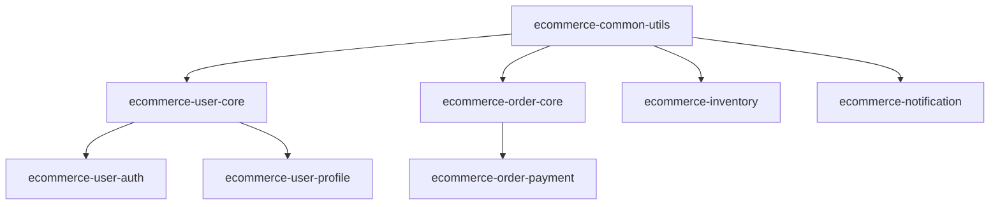

# 软件分包标准与管理流程规范

**标准版本**: v1.0  
**制定日期**: 2025-08-27  
**适用范围**: 企业级软件开发项目  
**标准等级**: 企业标准  

---

## 1. 概述

### 1.1 目的
本标准旨在建立统一的软件分包开发标准和管理流程，提高代码复用率，增强项目可维护性，规范团队协作开发。

### 1.2 适用范围
- 企业级软件开发项目
- 多团队协作开发项目  
- 需要高度模块化的大型项目
- 跨平台、跨语言项目

### 1.3 术语定义
- **分包（Package）**: 具有独立功能的代码模块，包含相关的类、函数、资源文件
- **核心包（Core Package）**: 提供基础功能的关键分包
- **业务包（Business Package）**: 实现特定业务逻辑的分包
- **工具包（Utility Package）**: 提供通用工具函数的分包
- **接口包（API Package）**: 定义对外接口的分包

---

## 2. 分包命名标准

### 2.1 命名原则

#### 2.1.1 基本原则
- **一致性**: 遵循统一的命名规范
- **可读性**: 名称应清晰表达功能目的
- **简洁性**: 避免冗余，保持简洁明了
- **层次性**: 体现分包的层次关系
- **国际化**: 使用英文命名，支持国际化

#### 2.1.2 命名格式
```
[组织前缀].[项目名称].[功能域].[子功能]
```

### 2.2 命名规范

#### 2.2.1 Java分包命名
```java
// 基础格式
com.company.project.module.submodule

// 示例
com.example.ecommerce.user.authentication
com.example.ecommerce.order.payment
com.example.ecommerce.inventory.stock
```

#### 2.2.2 Python分包命名
```python
# 基础格式
company_project_module_submodule

# 示例
example_ecommerce_user_auth
example_ecommerce_order_payment
example_ecommerce_inventory_stock
```

#### 2.2.3 JavaScript/Node.js分包命名
```javascript
// 基础格式（npm包）
@company/project-module-submodule

// 示例
@example/ecommerce-user-auth
@example/ecommerce-order-payment
@example/ecommerce-inventory-stock
```

#### 2.2.4 C#分包命名
```csharp
// 基础格式
Company.Project.Module.SubModule

// 示例
Example.ECommerce.User.Authentication
Example.ECommerce.Order.Payment
Example.ECommerce.Inventory.Stock
```

### 2.3 分包类型标识

| 类型 | 后缀标识 | 描述 | 示例 |
|------|----------|------|------|
| 核心包 | .core | 基础核心功能 | com.example.project.core |
| 业务包 | .business | 业务逻辑实现 | com.example.project.user.business |
| 数据包 | .data | 数据访问层 | com.example.project.user.data |
| 接口包 | .api | 对外接口定义 | com.example.project.user.api |
| 工具包 | .util | 通用工具函数 | com.example.project.common.util |
| 配置包 | .config | 配置管理 | com.example.project.config |
| 测试包 | .test | 测试代码 | com.example.project.user.test |

---

## 3. 分包功能划分原则

### 3.1 单一职责原则（SRP）
每个分包应该有且仅有一个明确的职责，避免功能耦合。

```java
// 正确示例：单一职责
com.example.user.authentication  // 专门处理用户认证
com.example.user.profile        // 专门处理用户信息
com.example.user.permission     // 专门处理用户权限

// 错误示例：职责混乱
com.example.user.everything     // 包含所有用户相关功能
```

### 3.2 高内聚低耦合原则
- **高内聚**: 分包内部元素紧密相关
- **低耦合**: 分包间依赖关系最小化

### 3.3 分层架构原则

#### 3.3.1 标准分层结构
```
├── presentation/     # 表现层
│   ├── controllers/
│   └── views/
├── business/         # 业务层
│   ├── services/
│   └── domain/
├── data/            # 数据层
│   ├── repositories/
│   └── entities/
└── infrastructure/  # 基础设施层
    ├── config/
    └── utils/
```

#### 3.3.2 分包依赖方向
```
presentation → business → data → infrastructure
```

### 3.4 业务域划分原则

#### 3.4.1 按业务功能划分
```
├── user/           # 用户管理域
├── order/          # 订单管理域
├── payment/        # 支付管理域
├── inventory/      # 库存管理域
└── notification/   # 通知管理域
```

#### 3.4.2 按技术功能划分
```
├── security/       # 安全功能
├── logging/        # 日志功能
├── caching/        # 缓存功能
├── monitoring/     # 监控功能
└── integration/    # 集成功能
```

---

## 4. 分包管理流程

### 4.1 分包生命周期管理

#### 4.1.1 分包创建流程
1. **需求分析**
   - 识别功能需求
   - 评估复用性
   - 确定分包边界

2. **设计阶段**
   - 制定接口规范
   - 设计内部架构
   - 评估依赖关系

3. **实现阶段**
   - 编码实现
   - 单元测试
   - 文档编写

4. **验收阶段**
   - 功能测试
   - 性能测试
   - 代码评审

5. **发布阶段**
   - 版本标记
   - 发布分包
   - 更新文档

#### 4.1.2 分包维护流程
1. **变更管理**
   - 变更申请
   - 影响评估
   - 变更审批

2. **版本管理**
   - 版本规划
   - 兼容性检查
   - 升级指导

3. **质量管理**
   - 代码质量检查
   - 性能监控
   - 缺陷管理

### 4.2 分包版本管理策略

#### 4.2.1 语义化版本控制（SemVer）
```
主版本号.次版本号.修订号 (MAJOR.MINOR.PATCH)

例如：1.2.3
- MAJOR：不兼容的API变更
- MINOR：向后兼容的功能新增
- PATCH：向后兼容的缺陷修复
```

#### 4.2.2 版本兼容性策略
- **向后兼容**: 新版本兼容旧版本接口
- **向前兼容**: 旧版本能处理新版本数据
- **破坏性变更**: 必须提前通知并提供迁移指南

### 4.3 分包依赖管理

#### 4.3.1 依赖层次管理
```
Level 1: 基础工具包（无外部依赖）
Level 2: 核心业务包（依赖Level 1）
Level 3: 业务逻辑包（依赖Level 1-2）
Level 4: 应用层包（依赖Level 1-3）
```

#### 4.3.2 循环依赖避免
- 使用接口抽象
- 引入中介层
- 重新设计包结构
- 使用依赖注入

---

## 5. 分包开发规范

### 5.1 目录结构标准

#### 5.1.1 Java项目结构
```
com/
└── example/
    └── project/
        └── module/
            ├── api/              # 对外接口
            │   ├── dto/         # 数据传输对象
            │   └── service/     # 服务接口
            ├── impl/            # 接口实现
            │   ├── service/     # 服务实现
            │   └── repository/  # 数据访问实现
            ├── model/           # 数据模型
            │   ├── entity/      # 实体类
            │   └── vo/          # 值对象
            ├── config/          # 配置类
            ├── exception/       # 异常定义
            └── util/            # 工具类
```

#### 5.1.2 前端项目结构
```
src/
├── components/      # 组件
├── services/        # 服务层
├── models/          # 数据模型
├── utils/           # 工具函数
├── constants/       # 常量定义
├── types/           # 类型定义
└── tests/           # 测试文件
```

### 5.2 接口设计规范

#### 5.2.1 API接口设计
```java
/**
 * 用户服务接口
 * @author 开发团队
 * @version 1.0.0
 * @since 2025-08-27
 */
public interface UserService {
    
    /**
     * 根据用户ID获取用户信息
     * @param userId 用户ID
     * @return 用户信息
     * @throws UserNotFoundException 用户不存在异常
     */
    UserDto getUserById(Long userId) throws UserNotFoundException;
    
    /**
     * 创建新用户
     * @param createUserRequest 创建用户请求
     * @return 创建的用户信息
     * @throws UserAlreadyExistsException 用户已存在异常
     */
    UserDto createUser(CreateUserRequest createUserRequest) 
        throws UserAlreadyExistsException;
}
```

#### 5.2.2 RESTful API规范
```yaml
# API路径规范
GET    /api/v1/users           # 获取用户列表
GET    /api/v1/users/{id}      # 获取特定用户
POST   /api/v1/users           # 创建用户
PUT    /api/v1/users/{id}      # 更新用户
DELETE /api/v1/users/{id}      # 删除用户

# 响应格式规范
{
  "code": 200,
  "message": "success",
  "data": {
    "id": 1,
    "name": "张三",
    "email": "zhangsan@example.com"
  },
  "timestamp": "2025-08-27T10:30:00Z"
}
```

### 5.3 文档规范

#### 5.3.1 分包README模板
```markdown
# 分包名称

## 概述
简要描述分包的功能和用途。

## 安装
```bash
# 安装命令
npm install @company/package-name
```

## 使用方法
```javascript
// 使用示例代码
const { SomeFunction } = require('@company/package-name');
const result = SomeFunction(params);
```

## API文档
详细的API接口说明。

## 配置说明
配置参数和选项说明。

## 变更日志
版本更新记录。

## 贡献指南
如何参与开发和贡献代码。

## 许可证
开源许可证信息。
```

#### 5.3.2 API文档规范
```javascript
/**
 * 用户认证服务
 * @module UserAuthService
 * @description 提供用户认证相关功能
 * @version 1.0.0
 * @author 开发团队
 * @since 2025-08-27
 * @example
 * const authService = new UserAuthService();
 * const result = await authService.login('username', 'password');
 */
class UserAuthService {
    /**
     * 用户登录
     * @method login
     * @param {string} username - 用户名
     * @param {string} password - 密码
     * @returns {Promise<Object>} 登录结果
     * @throws {AuthenticationError} 认证失败时抛出
     * @example
     * const result = await authService.login('admin', '123456');
     * console.log(result.token);
     */
    async login(username, password) {
        // 实现代码
    }
}
```

---

## 6. 分包质量保证

### 6.1 代码质量标准

#### 6.1.1 代码复杂度控制
- **圈复杂度**: 单个函数不超过10
- **类复杂度**: 单个类不超过50
- **包复杂度**: 单个包不超过100

#### 6.1.2 测试覆盖率要求
- **单元测试覆盖率**: ≥ 80%
- **集成测试覆盖率**: ≥ 70%
- **关键路径覆盖率**: 100%

#### 6.1.3 代码重复度控制
- **重复代码率**: ≤ 5%
- **相似度检查**: 使用工具自动检测

### 6.2 性能要求

#### 6.2.1 响应时间要求
- **接口响应时间**: ≤ 200ms
- **批量操作**: ≤ 2s
- **复杂查询**: ≤ 5s

#### 6.2.2 资源使用要求
- **内存使用**: 合理范围内
- **CPU使用**: 不超过80%
- **并发支持**: 满足业务需求

### 6.3 安全要求

#### 6.3.1 输入验证
- **参数校验**: 所有输入参数必须验证
- **SQL注入防护**: 使用参数化查询
- **XSS防护**: 输出编码处理

#### 6.3.2 权限控制
- **访问控制**: 实现基于角色的访问控制
- **数据权限**: 确保数据访问权限正确
- **API安全**: 实现API访问控制

---

## 7. 分包工具链

### 7.1 构建工具

#### 7.1.1 Java项目
```xml
<!-- Maven配置示例 -->
<project>
    <groupId>com.example</groupId>
    <artifactId>user-service</artifactId>
    <version>1.0.0</version>
    <packaging>jar</packaging>
    
    <dependencies>
        <dependency>
            <groupId>com.example</groupId>
            <artifactId>common-utils</artifactId>
            <version>1.0.0</version>
        </dependency>
    </dependencies>
</project>
```

#### 7.1.2 Node.js项目
```json
{
  "name": "@example/user-service",
  "version": "1.0.0",
  "description": "用户服务包",
  "main": "index.js",
  "scripts": {
    "build": "webpack --mode production",
    "test": "jest",
    "lint": "eslint src/"
  },
  "dependencies": {
    "@example/common-utils": "^1.0.0"
  },
  "devDependencies": {
    "jest": "^29.0.0",
    "eslint": "^8.0.0"
  }
}
```

### 7.2 版本管理工具

#### 7.2.1 Git分支策略
```bash
# 分包开发分支命名规范
feature/package-name-feature-description
bugfix/package-name-bug-description
hotfix/package-name-hotfix-description
release/package-name-v1.0.0
```

#### 7.2.2 标签管理
```bash
# 版本标签格式
package-name-v1.0.0
package-name-v1.0.1
package-name-v1.1.0
```

### 7.3 自动化工具

#### 7.3.1 持续集成配置
```yaml
# CI/CD Pipeline示例
name: Package Build and Test
on:
  push:
    branches: [ main, develop ]
  pull_request:
    branches: [ main ]

jobs:
  test:
    runs-on: ubuntu-latest
    steps:
      - uses: actions/checkout@v3
      - name: Setup Node.js
        uses: actions/setup-node@v3
        with:
          node-version: '18'
      - name: Install dependencies
        run: npm ci
      - name: Run tests
        run: npm test
      - name: Run linting
        run: npm run lint
      - name: Build package
        run: npm run build
```

---

## 8. 分包监控与度量

### 8.1 关键性能指标（KPI）

#### 8.1.1 开发效率指标
- **分包复用率**: 分包被引用次数/总分包数
- **开发周期**: 平均分包开发时间
- **缺陷率**: 单位时间内发现的缺陷数量

#### 8.1.2 质量指标
- **测试覆盖率**: 代码测试覆盖百分比
- **代码质量评分**: 静态代码分析评分
- **性能基准**: 响应时间、吞吐量等指标

#### 8.1.3 维护指标
- **变更频率**: 分包修改频次
- **依赖复杂度**: 分包依赖关系复杂程度
- **文档完整性**: 文档覆盖率和质量

### 8.2 监控工具

#### 8.2.1 代码质量监控
```yaml
# SonarQube配置
sonar.projectKey=example-packages
sonar.sources=src
sonar.tests=test
sonar.coverage.jacoco.xmlReportPaths=coverage/jacoco.xml
```

#### 8.2.2 性能监控
```javascript
// APM监控集成示例
const apm = require('elastic-apm-node').start({
  serviceName: 'user-service-package',
  secretToken: process.env.ELASTIC_APM_SECRET_TOKEN,
  serverUrl: process.env.ELASTIC_APM_SERVER_URL
});
```

---

## 9. 实施指南

### 9.1 分包迁移策略

#### 9.1.1 现有项目分包化
1. **现状分析**
   - 代码结构分析
   - 依赖关系梳理
   - 功能模块识别

2. **分包规划**
   - 确定分包边界
   - 制定迁移顺序
   - 评估风险影响

3. **渐进式迁移**
   - 优先级排序
   - 分阶段实施
   - 持续验证

#### 9.1.2 新项目分包设计
1. **架构设计**
   - 业务域分析
   - 分包架构设计
   - 接口定义

2. **开发计划**
   - 分包开发顺序
   - 里程碑设置
   - 资源分配

### 9.2 团队培训计划

#### 9.2.1 培训内容
- 分包标准规范
- 工具链使用
- 最佳实践分享
- 案例分析讨论

#### 9.2.2 培训方式
- 理论培训
- 实践操作
- 代码评审
- 经验分享

---

## 10. 案例研究

### 10.1 电商系统分包案例

#### 10.1.1 业务分包结构
```
ecommerce-system/
├── @company/ecommerce-user-core/      # 用户核心包
├── @company/ecommerce-user-auth/      # 用户认证包
├── @company/ecommerce-user-profile/   # 用户信息包
├── @company/ecommerce-order-core/     # 订单核心包
├── @company/ecommerce-order-payment/  # 支付处理包
├── @company/ecommerce-inventory/      # 库存管理包
├── @company/ecommerce-notification/   # 通知服务包
└── @company/ecommerce-common-utils/   # 通用工具包
```

#### 10.1.2 依赖关系图


### 10.2 微服务分包案例

#### 10.2.1 服务分包映射
```yaml
# 用户微服务
user-service:
  packages:
    - @company/user-domain
    - @company/user-api
    - @company/user-infrastructure

# 订单微服务  
order-service:
  packages:
    - @company/order-domain
    - @company/order-api
    - @company/order-infrastructure
    
# 共享包
shared:
  packages:
    - @company/common-events
    - @company/common-types
    - @company/common-utils
```

---

## 11. 附录

### 11.1 分包命名检查清单

- [ ] 是否遵循命名规范
- [ ] 名称是否准确表达功能
- [ ] 是否避免缩写和歧义
- [ ] 是否符合技术栈约定
- [ ] 是否考虑国际化要求

### 11.2 分包质量检查清单

- [ ] 单一职责是否明确
- [ ] 接口设计是否合理
- [ ] 依赖关系是否清晰
- [ ] 测试覆盖是否充分
- [ ] 文档是否完整
- [ ] 性能是否达标
- [ ] 安全要求是否满足

### 11.3 工具推荐列表

#### 11.3.1 Java生态工具
- **构建工具**: Maven, Gradle
- **依赖管理**: Maven Central, Nexus
- **质量检查**: SonarQube, SpotBugs
- **测试框架**: JUnit, TestNG

#### 11.3.2 JavaScript/Node.js生态工具
- **包管理**: npm, yarn, pnpm
- **构建工具**: Webpack, Rollup, Vite
- **质量检查**: ESLint, Prettier, SonarJS
- **测试框架**: Jest, Mocha, Vitest

#### 11.3.3 .NET生态工具
- **包管理**: NuGet
- **构建工具**: MSBuild, dotnet CLI
- **质量检查**: SonarQube, Roslyn Analyzers
- **测试框架**: xUnit, NUnit, MSTest

---

## 12. 版本历史

| 版本 | 日期 | 变更内容 | 作者 |
|------|------|----------|------|
| v1.0 | 2025-08-27 | 初始版本，建立完整的分包标准体系 | 标准制定专家 |

---

**文档状态**: 正式发布  
**审核状态**: 已审核  
**批准日期**: 2025-08-27  
**下次评审**: 2025-11-27  

---

*本标准遵循ISO/IEC指令第2部分的标准编写规则，确保标准的科学性、实用性和可操作性。*